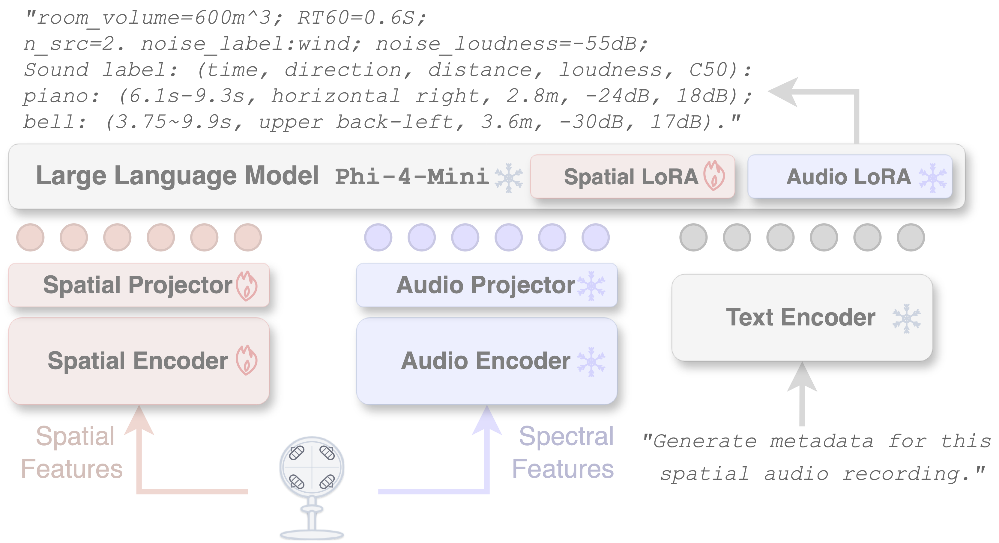

<u>***Xilin Jiang***</u> (Columbia University, work done as an intern in MSR), <u>***Hannes Gamper***</u> (Microsoft Research), <u>***Sebastian Braun***</u> (Microsoft Research)

<b>Abstract</b>: Acoustic scene perception spans what the sound is, when it occurs, where it is in direction and distance, and how it sounds in loudness and reverberation. While audio language models excel in sound recognition, single-channel input fundamentally limits spatial understanding. This work presents <em><strong>Sci-Phi</strong></em>, a spatial audio large language model with dual spatial and spectral encoders that estimates a complete parameter set for all sound sources and the surrounding environment. Learning from over 4,000 hours of synthetic first-order ambisonics recordings and their metadata, <em><strong>Sci-Phi</strong></em> enumerates and describes up to four sound sources in one pass, alongside background noise and room characteristics. We evaluate the model with a carefully designed permutation-invariant protocol and 15 metrics covering content, location, timing, loudness, and reverberation, and analyze its robustness across various signal-to-noise ratios, reverberation levels, and challenging cases such as spatially, temporally, or semantically overlapping sound sources. Notably, <em><strong>Sci-Phi</strong></em> generalizes to real room impulse responses with only minor performance degradation. Overall, this work establishes the first audio LLM capable of full spatial-scene description, with strong potential for real-world deployment.

The audio samples were converted from ambisonics into binaural for headphones. We strongly recommend wearing headphones to hear spatial cues (source direction).

<!-- ========== Real-RIR (END) ========== -->

<!-- ========== Synthetic-RIR (START) ========== -->

  
Synthetic-RIR Samples▶

  

<!-- === 🎧 Synthetic-RIR Sample 1 === -->

  

    <b>🎧 Synthetic-RIR Sample 1</b> 
    <audio controls>
      <source src="../samples/synthetic_rir/binaural/mix_8729_nsrc4.wav" type="audio/wav">
      Your browser does not support the audio element.
    </audio>
  

  <table>
    <tr>
      <th>Generated Description</th>
      <th>Ground-truth Description</th>
    </tr>
    <tr>
      <td>
        room_volume=1000m^3;
        RT60=0.4s;
        n_src=4.  noise_label: ambient sound;
        noise_loudness=-45dB. 
        Sound label: (time, direction, distance, loudness, C50): 
        English female speech with transcript ‘I can understand why they have gone away.’: 
        (5.3s-8.2s, upper front-left, 0.8m, -18dB, 22dB); 
        Nature:(0.0s-10.0s, horizontal front-right, 3.0m, -25dB, 13dB); 
        fingers on teeth:(8.0s-8.1s, horizontal back-left, 1.2m, -28dB, 19dB); 
        kick bass drum:(0.0s-10.0s, horizontal front-right, 3.4m, -33dB, 12dB).
      </td>
      <td>
        room_volume=1900m^3;
        RT60=0.4s;
        n_src=4. noise_label: ambient electronic hum;noise_loudness=-48dB. 
        Sound label: (time, direction, distance, loudness, C50): 
        English female speech with transcript ‘I can understand why they have gone.’: 
        (5.2s-8.5s, upper front-left, 1.3m, -19dB, 19dB); 
        Bonapartes Gull:(0.1s-8.5s, horizontal front-right, 4.4m, -25dB, 12dB); 
        baseball bat swing:(7.8s-8.5s, horizontal back-left, 1.6m, -28dB, 19dB); 
        axe chopping:(0.0s-7.5s, horizontal front-right, 4.4m, -35dB, 11dB).
      </td>
    </tr>
  </table>

<!-- === 🎧 Synthetic-RIR Sample 2 === -->

  

    <b>🎧 Synthetic-RIR Sample 2</b> 
    <audio controls>
      <source src="../samples/synthetic_rir/binaural/mix_6715_nsrc4.wav" type="audio/wav">
      Your browser does not support the audio element.
    </audio>
  

  <table>
    <tr>
      <th>Generated Description</th>
      <th>Ground-truth Description</th>
    </tr>
    <tr>
      <td>
        room_volume=1500m^3;
        RT60=0.3s;
        n_src=3. noise_label: ambient sounds;noise_loudness=-59dB. 
        Sound label: (time, direction, distance, loudness, C50): 
        English female speech with transcript ‘Of course, on a diet like this one, I wouldn't recommend.’: 
        (4.1s-8.2s, upper front-left, 0.8m, -33dB, 27dB); 
        English female speech with transcript ‘That goes without saying.’: 
        (4.1s-6.4s, lower back-right, 1.6m, -33dB, 22dB); 
        Nature:(0.0s-10.0s, horizontal front-left, 2.0m, -42dB, 20dB).
      </td>
      <td>
        room_volume=1900m^3;
        RT60=0.3s;
        n_src=4. noise_label: computer powering down;noise_loudness=-58dB. 
        Sound label: (time, direction, distance, loudness, C50): 
        English female speech with transcript ‘Of course, on Tuesday, United were beaten despite this.’: 
        (4.0s-7.9s, upper front-left, 0.8m, -33dB, 24dB); 
        censor beep:(4.7s-5.4s, horizontal back-left, 2.0m, -36dB, 18dB); 
        English male speech with transcript ‘That doesn't happen in Europe.’: 
        (3.6s-6.2s, horizontal back-right, 2.3m, -36dB, 17dB); 
        rattlesnake rattle:(0.0s-10.0s, horizontal front-left, 2.9m, -42dB, 14dB).
      </td>
    </tr>
  </table>

<!-- === 🎧 Synthetic-RIR Sample 3 === -->

  

    <b>🎧 Synthetic-RIR Sample 3</b> 
    <audio controls>
      <source src="../samples/synthetic_rir/binaural/mix_2280_nsrc4.wav" type="audio/wav">
      Your browser does not support the audio element.
    </audio>
  

  <table>
    <tr>
      <th>Generated Description</th>
      <th>Ground-truth Description</th>
    </tr>
    <tr>
      <td>
        room_volume=200m^3;
        RT60=0.5s;
        n_src=4. noise_label: rain;noise_loudness=-47dB. 
        Sound label: (time, direction, distance, loudness, C50): 
        female voice:(4.7s-6.6s, lower front-right, 1.1m, -25dB, 10dB); 
        applause:(2.0s-7.8s, lower back-right, 2.4m, -26dB, 7dB); 
        kettle pouring:(1.2s-9.4s, horizontal front-left, 0.8m, -34dB, 12dB); 
        English female speech with transcript ‘The briefcase held the day's knives.’: 
        (1.8s-4.7s, horizontal front, 1.0m, -37dB, 11dB).
      </td>
      <td>
        room_volume=200m^3;
        RT60=0.6s;
        n_src=4. noise_label: storm;noise_loudness=-49dB. 
        Sound label: (time, direction, distance, loudness, C50): 
        English female speech with transcript ‘You must be ready to play anyone.’: 
        (3.8s-6.8s, lower front-right, 0.8m, -26dB, 11dB); 
        audience applause:(1.7s-8.3s, lower back-right, 2.2m, -27dB, 6dB); 
        hot water pouring:(1.1s-8.9s, horizontal front-left, 0.8m, -36dB, 10dB); 
        English female speech with transcript ‘Everyone is taking a breath and waiting.’: 
        (1.5s-5.4s, horizontal front-right, 1.4m, -37dB, 8dB).
      </td>
    </tr>
  </table>

<!-- === 🎧 Synthetic-RIR Sample 4 === -->

  

    <b>🎧 Synthetic-RIR Sample 4</b> 
    <audio controls>
      <source src="../samples/synthetic_rir/binaural/mix_2952_nsrc4.wav" type="audio/wav">
      Your browser does not support the audio element.
    </audio>
  

  <table>
    <tr>
      <th>Generated Description</th>
      <th>Ground-truth Description</th>
    </tr>
    <tr>
      <td>
        room_volume=800m^3;
        RT60=0.7s;
        n_src=4. noise_label: rain;noise_loudness=-55dB. 
        Sound label: (time, direction, distance, loudness, C50): 
        animal growling:(2.6s-6.9s, upper front, 0.8m, -15dB, 17dB); 
        dog barking, dog growling, dog whimpering:(0.0s-10.0s, horizontal left, 2.4m, -26dB, 10dB); 
        robotic voice:(0.6s-4.2s, horizontal front, 5.5m, -28dB, 6dB); 
        English female speech with transcript ‘I should think so too.’: 
        (4.5s-6.8s, horizontal front-right, 2.4m, -32dB, 9dB).
      </td>
      <td>
        room_volume=600m^3;
        RT60=0.7s;
        n_src=4. noise_label: thunder;noise_loudness=-54dB. 
        Sound label: (time, direction, distance, loudness, C50): 
        zombie, demon:(2.8s-6.0s, upper front, 0.7m, -13dB, 16dB); 
        doberman pincher, barking:(0.0s-10.0s, horizontal left, 1.9m, -25dB, 10dB); 
        woosh, slow motion effect:(0.5s-4.0s, horizontal front, 6.1m, -26dB, 6dB); 
        English female speech with transcript ‘I should think so, too.’: 
        (4.6s-6.8s, horizontal front-right, 2.5m, -32dB, 9dB).
      </td>
    </tr>
  </table>

<!-- === 🎧 Synthetic-RIR Sample 5 === -->

  

    <b>🎧 Synthetic-RIR Sample 5</b> 
    <audio controls>
      <source src="../samples/synthetic_rir/binaural/mix_5438_nsrc4.wav" type="audio/wav">
      Your browser does not support the audio element.
    </audio>
  

  <table>
    <tr>
      <th>Generated Description</th>
      <th>Ground-truth Description</th>
    </tr>
    <tr>
      <td>
        room_volume=400m^3;
        RT60=0.6s;
        n_src=4. noise_label: environmental sounds;noise_loudness=-52dB. 
        Sound label: (time, direction, distance, loudness, C50): 
        soda can opening:(3.6s-4.3s, horizontal right, 0.8m, -27dB, 15dB); 
        ringtone:(0.0s-10.0s, upper front-left, 0.8m, -29dB, 15dB); 
        Nature:(0.0s-10.0s, horizontal front-right, 0.8m, -37dB, 15dB); 
        French speech with transcript ‘Il est le père de František Kaberle et Tomáš Kaberle.’: 
        (3.7s-8.4s, lower back-left, 2.1m, -42dB, 9dB).
      </td>
      <td>
        room_volume=700m^3;
        RT60=0.5s;
        n_src=4. noise_label: bell;noise_loudness=-54dB. 
        Sound label: (time, direction, distance, loudness, C50): 
        beer can opening:(3.6s-5.7s, horizontal right, 1.4m, -29dB, 13dB); 
        phone ringing:(0.0s-10.0s, upper front-left, 1.3m, -30dB, 14dB); 
        bear growling, bear roaring:(0.0s-10.0s, horizontal front-right, 1.2m, -39dB, 14dB); 
        voice, dice rolling:(4.6s-9.6s, lower back, 3.4m, -42dB, 8dB).
      </td>
    </tr>
  </table>

<!-- === 🎧 Synthetic-RIR Sample 6 === -->

  

    <b>🎧 Synthetic-RIR Sample 6</b> 
    <audio controls>
      <source src="../samples/synthetic_rir/binaural/mix_4550_nsrc3.wav" type="audio/wav">
      Your browser does not support the audio element.
    </audio>
  

  <table>
    <tr>
      <th>Generated Description</th>
      <th>Ground-truth Description</th>
    </tr>
    <tr>
      <td>
        room_volume=1500m^3;
        RT60=0.6s;
        n_src=3. noise_label: not present;noise_loudness=None. 
        Sound label: (time, direction, distance, loudness, C50): 
        English male speech with transcript ‘I've lost my head.’: 
        (2.2s-5.6s, horizontal back, 2.6m, -38dB, 13dB); 
        English female speech with transcript ‘A final agreement has not yet been completed.’: 
        (1.2s-4.6s, upper left, 1.0m, -41dB, 20dB); 
        English male speech with transcript ‘There was no time to mark.’: 
        (6.2s-8.2s, lower right, 2.8m, -41dB, 13dB).
      </td>
      <td>
        room_volume=1000m^3;
        RT60=0.6s;
        n_src=3. noise_label: not present;noise_loudness=None. 
        Sound label: (time, direction, distance, loudness, C50): 
        English male speech with transcript ‘I lost my head.’: 
        (3.1s-5.6s, horizontal back, 2.6m, -38dB, 12dB); 
        English female speech with transcript ‘A final agreement has not yet been completed.’: 
        (1.3s-4.4s, upper left, 0.9m, -40dB, 19dB); 
        English female speech with transcript ‘There was no time scale.’: 
        (6.2s-8.4s, lower right, 2.5m, -42dB, 12dB).
      </td>
    </tr>
  </table>

<!-- === 🎧 Synthetic-RIR Sample 7 === -->

  

    <b>🎧 Synthetic-RIR Sample 7</b> 
    <audio controls>
      <source src="../samples/synthetic_rir/binaural/mix_1076_nsrc3.wav" type="audio/wav">
      Your browser does not support the audio element.
    </audio>
  

  <table>
    <tr>
      <th>Generated Description</th>
      <th>Ground-truth Description</th>
    </tr>
    <tr>
      <td>
        room_volume=500m^3;
        RT60=0.6s;
        n_src=3. noise_label: ambient bathroom sounds;noise_loudness=-55dB. 
        Sound label: (time, direction, distance, loudness, C50): 
        aluminium foil tearing:(6.3s-6.8s, horizontal back, 1.2m, -25dB, 14dB); 
        English male speech with transcript ‘We were in different places, and we talked for a while.’: 
        (0.5s-4.1s, lower back-left, 0.8m, -28dB, 16dB); 
        fart:(8.6s-9.9s, horizontal front-left, 2.4m, -43dB, 10dB).
      </td>
      <td>
        room_volume=500m^3;
        RT60=0.6s;
        n_src=3. noise_label: horn;noise_loudness=-55dB. 
        Sound label: (time, direction, distance, loudness, C50): 
        patting or tapping:(6.3s-6.6s, horizontal back-right, 1.6m, -26dB, 12dB); 
        English male speech with transcript ‘We were in different places, usually in cellars.’: 
        (0.5s-4.6s, lower back-left, 0.8m, -28dB, 16dB); 
        fart:(8.6s-10.0s, horizontal front-left, 2.7m, -44dB, 10dB).
      </td>
    </tr>
  </table>

<!-- === 🎧 Synthetic-RIR Sample 8 === -->

  

    <b>🎧 Synthetic-RIR Sample 8</b> 
    <audio controls>
      <source src="../samples/synthetic_rir/binaural/mix_1144_nsrc3.wav" type="audio/wav">
      Your browser does not support the audio element.
    </audio>
  

  <table>
    <tr>
      <th>Generated Description</th>
      <th>Ground-truth Description</th>
    </tr>
    <tr>
      <td>
        room_volume=500m^3;
        RT60=0.8s;
        n_src=3. noise_label: fireworks;noise_loudness=-68dB. 
        Sound label: (time, direction, distance, loudness, C50): 
        explosion-like sound:(5.7s-9.1s, horizontal front, 1.1m, -45dB, 10dB); 
        water pouring:(0.0s-10.0s, upper front, 1.4m, -48dB, 9dB); 
        English male speech with transcript ‘I always fall asleep when I'm doing something.’: 
        (5.2s-8.6s, lower right, 1.1m, -48dB, 10dB).
      </td>
      <td>
        room_volume=900m^3;
        RT60=0.9s;
        n_src=3. noise_label: priest walking in hard sole shoes;noise_loudness=-66dB. 
        Sound label: (time, direction, distance, loudness, C50): 
        time bomb:(1.8s-8.3s, horizontal front, 1.6m, -47dB, 10dB); 
        pouring drink:(0.0s-10.0s, upper front, 2.1m, -48dB, 9dB); 
        English male speech with transcript ‘I always felt that I was in control of the match.’: 
        (5.3s-8.9s, lower front-right, 2.1m, -48dB, 9dB).
      </td>
    </tr>
  </table>

<!-- === 🎧 Synthetic-RIR Sample 9 === -->

  

    <b>🎧 Synthetic-RIR Sample 9</b> 
    <audio controls>
      <source src="../samples/synthetic_rir/binaural/mix_1339_nsrc3.wav" type="audio/wav">
      Your browser does not support the audio element.
    </audio>
  

  <table>
    <tr>
      <th>Generated Description</th>
      <th>Ground-truth Description</th>
    </tr>
    <tr>
      <td>
        room_volume=1300m^3;
        RT60=0.6s;
        n_src=3. noise_label: not present;noise_loudness=None. 
        Sound label: (time, direction, distance, loudness, C50): 
        button click:(1.9s-2.4s, horizontal right, 7.0m, -32dB, 6dB); 
        coin drop:(7.7s-8.5s, upper back-right, 0.8m, -35dB, 18dB); 
        metal band:(1.5s-3.4s, horizontal back-left, 2.5m, -42dB, 10dB).
      </td>
      <td>
        room_volume=1000m^3;
        RT60=0.7s;
        n_src=3. noise_label: not present;noise_loudness=None. 
        Sound label: (time, direction, distance, loudness, C50): 
        button click:(1.9s-6.9s, horizontal right, 9.5m, -34dB, 6dB); 
        metal impact:(7.8s-8.5s, horizontal back-right, 0.7m, -35dB, 18dB); 
        boxing bell:(1.6s-3.3s, horizontal back-left, 2.6m, -41dB, 9dB).
      </td>
    </tr>
  </table>

<!-- === 🎧 Synthetic-RIR Sample 10 === -->

  

    <b>🎧 Synthetic-RIR Sample 10</b> 
    <audio controls>
      <source src="../samples/synthetic_rir/binaural/mix_1358_nsrc3.wav" type="audio/wav">
      Your browser does not support the audio element.
    </audio>
  

  <table>
    <tr>
      <th>Generated Description</th>
      <th>Ground-truth Description</th>
    </tr>
    <tr>
      <td>
        room_volume=500m^3;
        RT60=0.8s;
        n_src=3. noise_label: not present;noise_loudness=None. 
        Sound label: (time, direction, distance, loudness, C50): 
        human scream:(0.1s-7.1s, horizontal front-right, 1.1m, -31dB, 12dB); 
        drum, snare:(1.8s-2.0s, upper back-right, 0.9m, -42dB, 13dB); 
        English speech with transcript ‘A thousand years ago, the city was the center of an ancient civilisation.’: 
        (4.7s-8.9s, lower back-left, 1.8m, -44dB, 9dB).
      </td>
      <td>
        room_volume=600m^3;
        RT60=0.8s;
        n_src=3. noise_label: not present;noise_loudness=None. 
        Sound label: (time, direction, distance, loudness, C50): 
        crow:(0.4s-6.4s, horizontal front-right, 1.2m, -31dB, 12dB); 
        punch:(1.8s-2.2s, upper back-right, 1.1m, -42dB, 13dB); 
        English male speech with transcript ‘A thousand years ago the church was a powerful force in Europe.’: 
        (4.6s-8.8s, lower back-left, 2.3m, -44dB, 9dB).
      </td>
    </tr>
  </table>

  

<!-- ========== Synthetic-RIR (END) ========== -->

<!-- ========== Real-RIR (START) ========== -->

  
Real-RIR Samples▶

  

<!-- === 🎧 Real-RIR Sample 1 === -->

  

    <b>🎧 Real-RIR Sample 1</b> 
    <audio controls>
      <source src="../samples/real_rir/binaural/mix_615_nsrc4.wav" type="audio/wav">
      Your browser does not support the audio element.
    </audio>
  

  <table>
    <tr>
      <th>Generated Description</th>
      <th>Ground-truth Description</th>
    </tr>
    <tr>
      <td>
        room_volume=1000m^3;
        RT60=0.2s;
        n_src=4. noise_label: ambient noise;noise_loudness=-50dB. 
        Sound label: (time, direction, distance, loudness, C50): 
        bricks falling:(2.7s-4.5s, horizontal front, 1.4m, -22dB, 22dB); 
        dough hook tapping:(1.3s-2.6s, horizontal back-right, 0.8m, -25dB, 27dB); 
        coin sound effect:(7.9s-8.6s, horizontal back, 2.0m, -30dB, 20dB); 
        English female speech with transcript ‘However, no further action was taken by police.’: 
        (3.7s-7.8s, horizontal back-right, 0.8m, -37dB, 27dB).
      </td>
      <td>
        room_volume=Unknown; 
        RT60=0.2s;
        n_src=4. noise_label: ambient noise;noise_loudness=-72dB. 
        Sound label: (time, direction, distance, loudness, C50): 
        toy train:(2.7s-4.4s, horizontal front, 1.5m, -21dB, 28dB); 
        wood block:(1.3s-2.1s, horizontal back-right, 0.8m, -22dB, 21dB); 
        bicycle bell:(7.9s-8.5s, horizontal back, 0.8m, -26dB, 17dB); 
        English male speech with transcript ‘However, no further action was taken by police.’: 
        (3.6s-7.3s, horizontal right, 1.5m, -37dB, 26dB).
      </td>
    </tr>
  </table>

<!-- === 🎧 Real-RIR Sample 2 === -->

  

    <b>🎧 Real-RIR Sample 2</b> 
    <audio controls>
      <source src="../samples/real_rir/binaural/mix_6810_nsrc4.wav" type="audio/wav">
      Your browser does not support the audio element.
    </audio>
  

  <table>
    <tr>
      <th>Generated Description</th>
      <th>Ground-truth Description</th>
    </tr>
    <tr>
      <td>
        room_volume=700m^3;
        RT60=0.2s;
        n_src=3. noise_label: not present;noise_loudness=None. 
        Sound label: (time, direction, distance, loudness, C50): 
        guitar:(2.2s-4.6s, horizontal back-left, 1.0m, -27dB, 25dB); 
        English male speech with transcript ‘Only one person can claim the credit.’: 
        (3.0s-6.1s, horizontal front, 0.8m, -33dB, 27dB); 
        shaker:(5.2s-7.2s, horizontal back-left, 1.0m, -35dB, 25dB).
      </td>
      <td>
        room_volume=Unknown; 
        RT60=0.6s;
        n_src=4. noise_label: ambient noise;noise_loudness=-80dB. 
        Sound label: (time, direction, distance, loudness, C50): 
        piano:(2.2s-4.4s, horizontal back-left, 0.8m, -26dB, 27dB); 
        English male speech with transcript ‘Only one person can claim the credit.’: 
        (2.9s-6.0s, horizontal front, 1.5m, -33dB, 22dB); 
        English female speech with transcript ‘We deserved the three points.’: 
        (3.0s-6.8s, horizontal back-left, 0.8m, -38dB, 27dB); 
        shaker:(5.1s-7.2s, horizontal back-left, 0.8m, -38dB, 24dB).
      </td>
    </tr>
  </table>

<!-- === 🎧 Real-RIR Sample 3 === -->

  

    <b>🎧 Real-RIR Sample 3</b> 
    <audio controls>
      <source src="../samples/real_rir/binaural/mix_7837_nsrc4.wav" type="audio/wav">
      Your browser does not support the audio element.
    </audio>
  

  <table>
    <tr>
      <th>Generated Description</th>
      <th>Ground-truth Description</th>
    </tr>
    <tr>
      <td>
        room_volume=700m^3;
        RT60=0.6s;
        n_src=4. noise_label: ambient room noise;noise_loudness=-64dB. 
        Sound label: (time, direction, distance, loudness, C50): 
        Bongo, Congo:(1.9s-2.1s, horizontal front, 0.8m, -35dB, 16dB); 
        clapping:(1.6s-3.4s, horizontal left, 0.7m, -40dB, 17dB); 
        human speech:(5.8s-8.4s, lower back-right, 1.5m, -46dB, 12dB); 
        ticking clock sound, voice:(4.5s-6.4s, horizontal back-right, 0.8m, -49dB, 16dB).
      </td>
      <td>
        room_volume=Unknown; 
        RT60=1.3s;
        n_src=4. noise_label: ambient noise;noise_loudness=-77dB. 
        Sound label: (time, direction, distance, loudness, C50): 
        hit drum:(1.8s-2.2s, horizontal front, 1.5m, -36dB, 13dB); 
        hand clap:(1.7s-3.3s, horizontal left, 0.8m, -39dB, 16dB); 
        English female speech with transcript ‘I am about protecting the state pension.’: 
        (5.1s-8.7s, horizontal back-right, 1.5m, -45dB, 13dB); 
        wood block:(4.6s-5.8s, horizontal back-right, 0.8m, -46dB, 17dB).
      </td>
    </tr>
  </table>

<!-- === 🎧 Real-RIR Sample 4 === -->

  

    <b>🎧 Real-RIR Sample 4</b> 
    <audio controls>
      <source src="../samples/real_rir/binaural/mix_7995_nsrc4.wav" type="audio/wav">
      Your browser does not support the audio element.
    </audio>
  

  <table>
    <tr>
      <th>Generated Description</th>
      <th>Ground-truth Description</th>
    </tr>
    <tr>
      <td>
        room_volume=700m^3;
        RT60=0.3s;
        n_src=3. noise_label: ambient environmental sounds;noise_loudness=-55dB. 
        Sound label: (time, direction, distance, loudness, C50): 
        female voice:(0.0s-10.0s, horizontal front, 1.1m, -28dB, 20dB); 
        English speech with transcript ‘Or maybe it's the other way around.’: 
        (3.9s-6.5s, horizontal front-left, 0.7m, -35dB, 23dB); 
        Military:(0.0s-10.0s, upper front-right, 1.4m, -38dB, 18dB).
      </td>
      <td>
        room_volume=Unknown; 
        RT60=0.5s;
        n_src=4. noise_label: ambient noise;noise_loudness=-62dB. 
        Sound label: (time, direction, distance, loudness, C50): 
        English female speech with transcript ‘Anyone remaining after that will be targeted.’: 
        (0.6s-5.0s, horizontal front, 1.5m, -26dB, 16dB); 
        English female speech with transcript ‘Or maybe it's the other way around.’: 
        (3.4s-6.4s, horizontal left, 0.8m, -33dB, 22dB); 
        hand clap:(0.6s-2.3s, horizontal front, 0.8m, -34dB, 18dB); 
        toy train:(0.0s-4.5s, horizontal front-right, 1.5m, -34dB, 14dB).
      </td>
    </tr>
  </table>

<!-- === 🎧 Real-RIR Sample 5 === -->

  

    <b>🎧 Real-RIR Sample 5</b> 
    <audio controls>
      <source src="../samples/real_rir/binaural/mix_8179_nsrc4.wav" type="audio/wav">
      Your browser does not support the audio element.
    </audio>
  

  <table>
    <tr>
      <th>Generated Description</th>
      <th>Ground-truth Description</th>
    </tr>
    <tr>
      <td>
        room_volume=400m^3;
        RT60=0.5s;
        n_src=4. noise_label: ambient noise;noise_loudness=-49dB. 
        Sound label: (time, direction, distance, loudness, C50): 
        English speech with transcript ‘We don't want to be too intrusive.’: 
        (7.1s-9.8s, horizontal right, 0.8m, -20dB, 15dB); 
        English female speech with transcript ‘I guess they just can't help it.’: 
        (7.7s-10.0s, upper back-left, 2.0m, -24dB, 9dB); 
        Congo drum:(6.5s-6.6s, horizontal front, 1.1m, -26dB, 12dB); 
        castanet:(0.4s-2.4s, horizontal back, 1.8m, -38dB, 9dB).
      </td>
      <td>
        room_volume=Unknown; 
        RT60=0.7s;
        n_src=4. noise_label: ambient noise;noise_loudness=-65dB. 
        Sound label: (time, direction, distance, loudness, C50): 
        English female speech with transcript ‘We don't want to be too intrusive.’: 
        (7.1s-9.8s, horizontal right, 0.8m, -20dB, 16dB); 
        English male speech with transcript ‘That is my preference.’: 
        (7.7s-10.0s, horizontal back-left, 1.5m, -25dB, 11dB); 
        hit drum:(6.5s-6.8s, horizontal front, 1.5m, -26dB, 11dB); 
        wood block:(0.5s-1.9s, horizontal back, 1.5m, -37dB, 9dB).
      </td>
    </tr>
  </table>

<!-- === 🎧 Real-RIR Sample 6 === -->

  

    <b>🎧 Real-RIR Sample 6</b> 
    <audio controls>
      <source src="../samples/real_rir/binaural/mix_2429_nsrc3.wav" type="audio/wav">
      Your browser does not support the audio element.
    </audio>
  

  <table>
    <tr>
      <th>Generated Description</th>
      <th>Ground-truth Description</th>
    </tr>
    <tr>
      <td>
        room_volume=2200m^3;
        RT60=0.5s;
        n_src=3. noise_label: not present;noise_loudness=None. 
        Sound label: (time, direction, distance, loudness, C50): 
        tapping of broom, concrete floor, wooden broom scrape, woody thump:(8.3s-9.2s, upper front-right, 0.7m, -32dB, 23dB); 
        sax baritone:(3.5s-6.9s, horizontal left, 1.9m, -33dB, 16dB); 
        English speech with transcript ‘So, in a sense, it was a selfless act.’: 
        (0.0s-7.2s, horizontal front, 0.8m, -37dB, 22dB).
      </td>
      <td>
        room_volume=Unknown; 
        RT60=0.7s;
        n_src=3. noise_label: ambient noise;noise_loudness=-75dB. 
        Sound label: (time, direction, distance, loudness, C50): 
        wood block:(8.3s-9.1s, horizontal front-right, 0.8m, -27dB, 27dB); 
        organ:(4.1s-5.9s, horizontal left, 1.5m, -30dB, 18dB); 
        English male speech with transcript ‘So, in a sense, it was a government subsidy.’: 
        (3.1s-7.1s, horizontal front, 1.5m, -36dB, 21dB).
      </td>
    </tr>
  </table>

<!-- === 🎧 Real-RIR Sample 7 === -->

  

    <b>🎧 Real-RIR Sample 7</b> 
    <audio controls>
      <source src="../samples/real_rir/binaural/mix_6735_nsrc3.wav" type="audio/wav">
      Your browser does not support the audio element.
    </audio>
  

  <table>
    <tr>
      <th>Generated Description</th>
      <th>Ground-truth Description</th>
    </tr>
    <tr>
      <td>
        room_volume=1000m^3;
        RT60=0.4s;
        n_src=4. noise_label: thunder;noise_loudness=-72dB. 
        Sound label: (time, direction, distance, loudness, C50): 
        English speech with transcript ‘It's a delightful idea, but the implementation is extremely complicated.’: 
        (4.4s-7.3s, horizontal front, 0.8m, -42dB, 19dB); 
        English female speech with transcript ‘Party is up for it!’: 
        (3.2s-5.5s, horizontal back-left, 0.7m, -43dB, 20dB); 
        English speech with transcript ‘That'll be the case on Tuesday.’: 
        (7.5s-9.7s, horizontal left, 1.3m, -50dB, 16dB); 
        footsteps on carpet:(0.0s-10.0s, horizontal front-left, 1.6m, -59dB, 15dB).
      </td>
      <td>
        room_volume=Unknown; 
        RT60=0.7s;
        n_src=3. noise_label: ambient noise;noise_loudness=-65dB. 
        Sound label: (time, direction, distance, loudness, C50): 
        English female speech with transcript ‘The party is up for it.’: 
        (2.9s-4.9s, horizontal back-left, 0.8m, -40dB, 19dB); 
        English female speech with transcript ‘It's a delightful idea, but a distancing one.’: 
        (4.3s-7.7s, horizontal front, 1.5m, -41dB, 16dB); 
        English female speech with transcript ‘That will be the case on Tuesday.’: 
        (7.5s-9.8s, horizontal left, 1.5m, -47dB, 12dB).
      </td>
    </tr>
  </table>

<!-- === 🎧 Real-RIR Sample 8 === -->

  

    <b>🎧 Real-RIR Sample 8</b> 
    <audio controls>
      <source src="../samples/real_rir/binaural/mix_8538_nsrc3.wav" type="audio/wav">
      Your browser does not support the audio element.
    </audio>
  

  <table>
    <tr>
      <th>Generated Description</th>
      <th>Ground-truth Description</th>
    </tr>
    <tr>
      <td>
        room_volume=500m^3;
        RT60=0.4s;
        n_src=3. noise_label: ambient background noise;noise_loudness=-55dB. 
        Sound label: (time, direction, distance, loudness, C50): 
        English female speech with transcript ‘We want to sort it out.’: 
        (5.0s-7.3s, horizontal right, 1.6m, -35dB, 12dB); 
        English female speech with transcript ‘You need a trademark.’: 
        (7.4s-10.0s, horizontal left, 0.7m, -37dB, 18dB); 
        English speech with transcript ‘The man was obviously desperate enough to hire a private thief.’: 
        (0.2s-4.2s, horizontal front, 1.2m, -44dB, 14dB).
      </td>
      <td>
        room_volume=Unknown; 
        RT60=0.6s;
        n_src=3. noise_label: ambient noise;noise_loudness=-66dB. 
        Sound label: (time, direction, distance, loudness, C50): 
        English male speech with transcript ‘We want to sort it out.’: 
        (5.0s-7.3s, horizontal right, 1.5m, -35dB, 13dB); 
        English female speech with transcript ‘You need a trademark.’: 
        (7.4s-9.6s, horizontal left, 0.8m, -37dB, 17dB); 
        English female speech with transcript ‘The man was obviously desperate to get away from the police.’: 
        (0.0s-4.0s, horizontal front, 1.5m, -42dB, 12dB).
      </td>
    </tr>
  </table>

<!-- === 🎧 Real-RIR Sample 9 === -->

  

    <b>🎧 Real-RIR Sample 9</b> 
    <audio controls>
      <source src="../samples/real_rir/binaural/mix_9863_nsrc3.wav" type="audio/wav">
      Your browser does not support the audio element.
    </audio>
  

  <table>
    <tr>
      <th>Generated Description</th>
      <th>Ground-truth Description</th>
    </tr>
    <tr>
      <td>
        room_volume=700m^3;
        RT60=0.4s;
        n_src=3. noise_label: ambient sounds;noise_loudness=-55dB. 
        Sound label: (time, direction, distance, loudness, C50): 
        brass bell:(2.4s-3.1s, horizontal left, 0.7m, -28dB, 20dB); 
        Military:(2.5s-8.6s, horizontal front, 1.1m, -30dB, 17dB); 
        percussion:(4.1s-6.0s, horizontal front, 0.8m, -40dB, 19dB).
      </td>
      <td>
        room_volume=Unknown; 
        RT60=1.7s;
        n_src=3. noise_label: ambient noise;noise_loudness=-85dB. 
        Sound label: (time, direction, distance, loudness, C50): 
        bicycle bell:(2.4s-3.3s, horizontal left, 0.8m, -29dB, 19dB); 
        toy train:(3.1s-7.3s, horizontal front, 1.5m, -30dB, 14dB); 
        hand clap:(4.1s-5.6s, horizontal front, 1.5m, -38dB, 15dB).
      </td>
    </tr>
  </table>

<!-- === 🎧 Real-RIR Sample 10 === -->

  

    <b>🎧 Real-RIR Sample 10</b> 
    <audio controls>
      <source src="../samples/real_rir/binaural/mix_1356_nsrc2.wav" type="audio/wav">
      Your browser does not support the audio element.
    </audio>
  

  <table>
    <tr>
      <th>Generated Description</th>
      <th>Ground-truth Description</th>
    </tr>
    <tr>
      <td>
        room_volume=500m^3;
        RT60=0.4s;
        n_src=1. noise_label: car horn;noise_loudness=-35dB. 
        Sound label: (time, direction, distance, loudness, C50): 
        English speech with transcript ‘That is giving me great confidence.’: 
        (2.8s-9.9s, horizontal left, 0.7m, -40dB, 19dB).
      </td>
      <td>
        room_volume=Unknown; 
        RT60=0.6s;
        n_src=2. noise_label: ambient noise;noise_loudness=-76dB. 
        Sound label: (time, direction, distance, loudness, C50): 
        organ:(2.9s-5.0s, horizontal front-left, 1.5m, -22dB, 11dB); 
        English female speech with transcript ‘That has given me great confidence.’: 
        (3.2s-6.1s, horizontal left, 0.8m, -36dB, 17dB).
      </td>
    </tr>
  </table>

<!-- === 🎧 Real-RIR Sample 11 === -->

  

    <b>🎧 Real-RIR Sample 11</b> 
    <audio controls>
      <source src="../samples/real_rir/binaural/mix_5468_nsrc2.wav" type="audio/wav">
      Your browser does not support the audio element.
    </audio>
  

  <table>
    <tr>
      <th>Generated Description</th>
      <th>Ground-truth Description</th>
    </tr>
    <tr>
      <td>
        room_volume=1500m^3;
        RT60=0.2s;
        n_src=2. noise_label: ambient noise;noise_loudness=-55dB. 
        Sound label: (time, direction, distance, loudness, C50): 
        hi hat:(7.9s-9.9s, horizontal front, 1.8m, -28dB, 22dB); 
        English female speech with transcript ‘They had to be cut from the wreckage.’: 
        (1.9s-6.2s, upper back-left, 0.8m, -39dB, 28dB).
      </td>
      <td>
        room_volume=Unknown; 
        RT60=0.2s;
        n_src=2. noise_label: ambient noise;noise_loudness=-72dB. 
        Sound label: (time, direction, distance, loudness, C50): 
        shaker:(7.9s-10.0s, horizontal front, 1.5m, -29dB, 25dB); 
        English female speech with transcript ‘They had to be cut from the wreckage.’: 
        (2.0s-6.2s, horizontal back-left, 0.8m, -37dB, 30dB).
      </td>
    </tr>
  </table>

<!-- === 🎧 Real-RIR Sample 12 === -->

  

    <b>🎧 Real-RIR Sample 12</b> 
    <audio controls>
      <source src="../samples/real_rir/binaural/mix_5640_nsrc2.wav" type="audio/wav">
      Your browser does not support the audio element.
    </audio>
  

  <table>
    <tr>
      <th>Generated Description</th>
      <th>Ground-truth Description</th>
    </tr>
    <tr>
      <td>
        room_volume=1000m^3;
        RT60=0.6s;
        n_src=2. noise_label: ambient room sounds;noise_loudness=-55dB. 
        Sound label: (time, direction, distance, loudness, C50): 
        electronic alarm:(5.1s-9.7s, horizontal front, 0.8m, -34dB, 17dB); 
        English speech with transcript ‘That was never her agenda.’: 
        (0.1s-9.6s, horizontal left, 0.7m, -42dB, 18dB).
      </td>
      <td>
        room_volume=Unknown; 
        RT60=0.7s;
        n_src=2. noise_label: ambient noise;noise_loudness=-67dB. 
        Sound label: (time, direction, distance, loudness, C50): 
        security buzzer:(6.1s-8.4s, horizontal front-right, 1.5m, -33dB, 18dB); 
        English female speech with transcript ‘That was never their agenda.’: 
        (2.9s-5.8s, horizontal left, 1.5m, -42dB, 17dB).
      </td>
    </tr>
  </table>

<!-- === 🎧 Real-RIR Sample 13 === -->

  

    <b>🎧 Real-RIR Sample 13</b> 
    <audio controls>
      <source src="../samples/real_rir/binaural/mix_575_nsrc2.wav" type="audio/wav">
      Your browser does not support the audio element.
    </audio>
  

  <table>
    <tr>
      <th>Generated Description</th>
      <th>Ground-truth Description</th>
    </tr>
    <tr>
      <td>
        room_volume=200m^3;
        RT60=0.5s;
        n_src=3. noise_label: stairs;noise_loudness=-79dB. 
        Sound label: (time, direction, distance, loudness, C50): 
        English male speech with transcript ‘He is an extraordinary writer on so many levels.’: 
        (5.0s-9.7s, horizontal left, 1.1m, -51dB, 10dB); 
        bell:(4.3s-9.8s, horizontal front, 0.8m, -53dB, 12dB); 
        Nature:(0.0s-10.0s, horizontal left, 1.1m, -64dB, 10dB).
      </td>
      <td>
        room_volume=Unknown; 
        RT60=0.6s;
        n_src=2. noise_label: ambient noise;noise_loudness=-74dB. 
        Sound label: (time, direction, distance, loudness, C50): 
        English male speech with transcript ‘He is an extraordinary writer on so many levels.’: 
        (4.9s-9.3s, horizontal left, 1.5m, -49dB, 9dB); 
        metallophone:(6.2s-9.0s, horizontal front, 1.5m, -51dB, 10dB).
      </td>
    </tr>
  </table>

  

